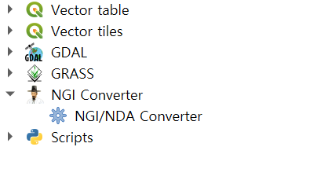
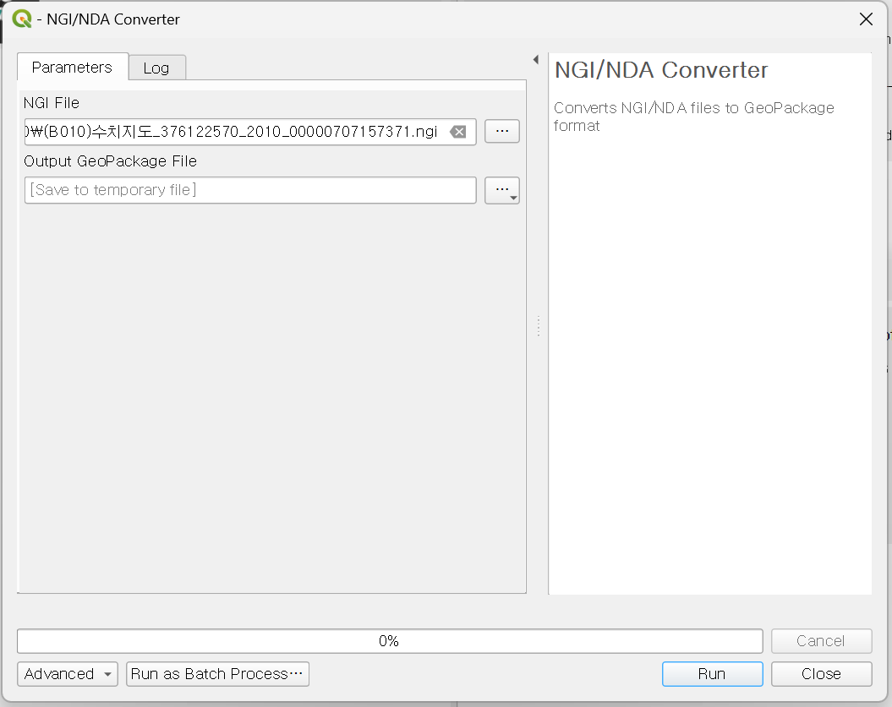
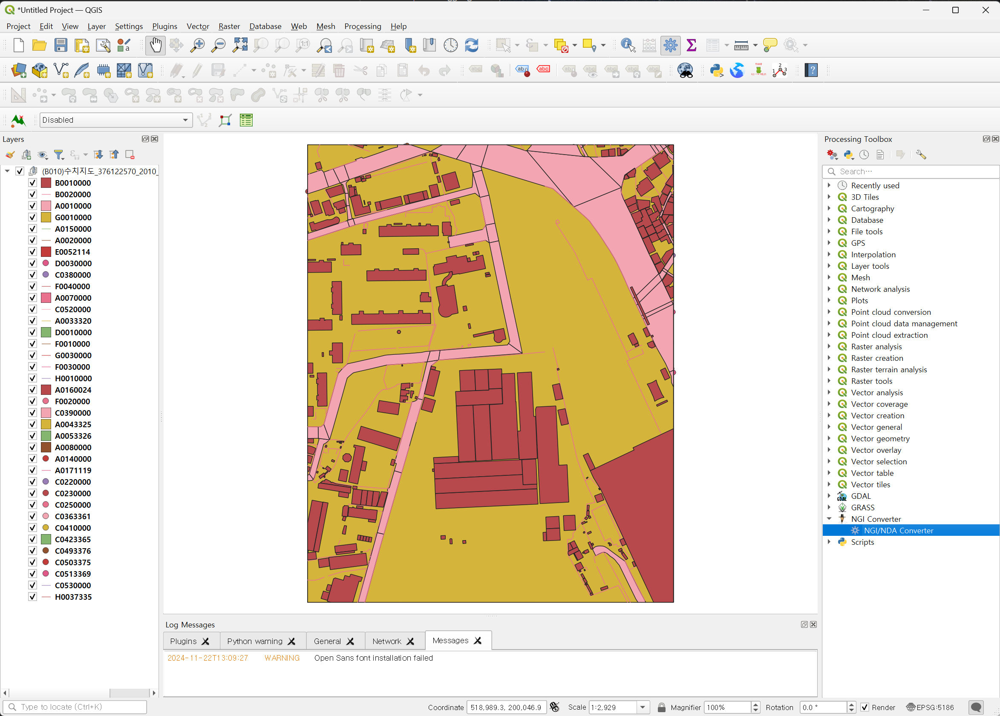
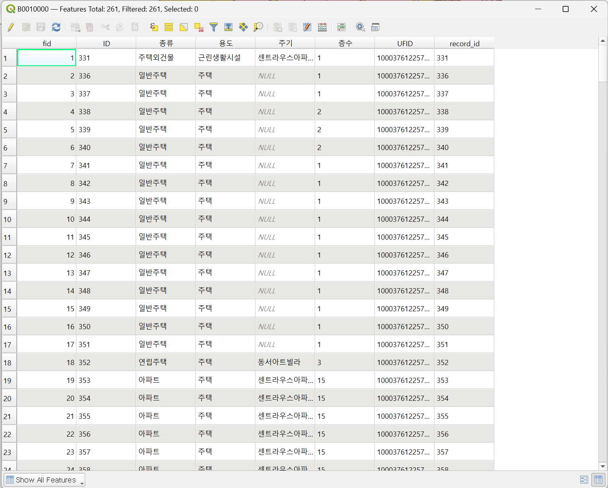

## NGI File Loader

This is a QGIS plugin that loads NGI files from the Korea Land and Geographic Information Institute into QGIS.

This is a plugin that loads digital map 2.0 NGI files provided by the [Public Data Portal](https://www.data.go.kr/data/15059719/fileData.do) and the [National Land Information Platform](https://map.ngii.go.kr/ms/map/NlipMap.do?tabGb=total) into QGIS.

You can download and use 1:5000 digital map files (NGI files) from the [National Land Information Platform](https://map.ngii.go.kr/ms/map/NlipMap.do?tabGb=total).

---

### (Korean) NGI 파일 로더

한국국토지리원의 NGI 파일을 QGIS에 로드하는 QGIS 플러그인입니다.

[공공데이터포털](https://www.data.go.kr/data/15059719/fileData.do)과 [국토정보플랫폼](https://map.ngii.go.kr/ms/map/NlipMap.do?tabGb=total)에서 제공하는 수치지도2.0 NGI 파일을 QGIS에 로드하는 플러그인입니다.

[국토정보플랫폼](https://map.ngii.go.kr/ms/map/NlipMap.do?tabGb=total)에서 1:5000 수치지도 파일(NGI 파일)을 다운로드 받아 사용할 수 있습니다.

## Gallery

